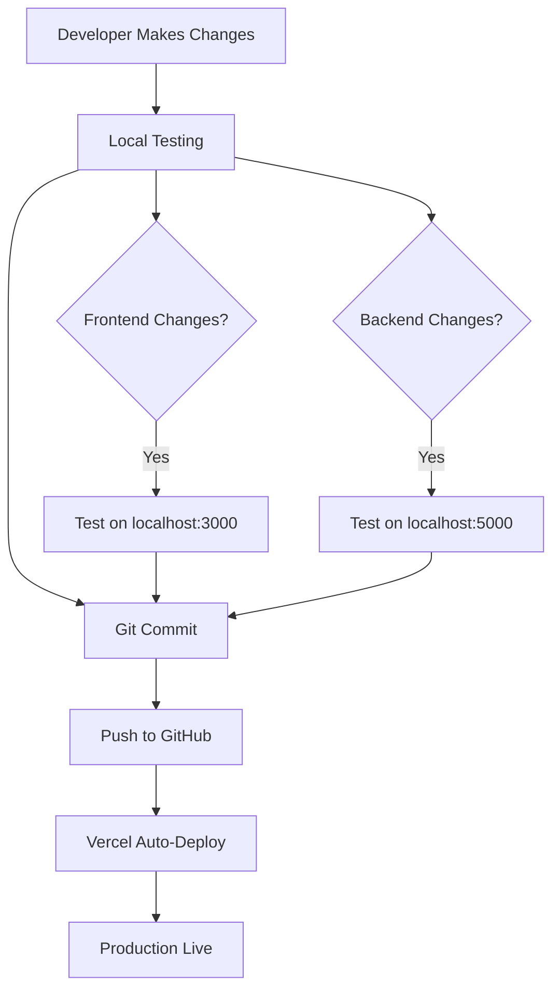

# Weather Dashboard 🌦️

A modern, responsive weather application that provides real-time weather data and 5-day forecasts for cities worldwide. Built with React and Node.js, deployed on Vercel.

## 🌐 Live Demo

**Production URL:** [https://weather-dashboard-orpin-ten.vercel.app](https://weather-dashboard-orpin-ten.vercel.app)

## ✨ Features

- 🔍 Search weather by city name
- 🌡️ Real-time temperature, humidity, and wind speed data
- 📅 5-day weather forecast
- 🎨 Beautiful gradient UI with responsive design
- ⚡ Fast serverless API deployment
- 🌍 Worldwide coverage using OpenWeatherMap API

## 🏗️ Architecture

### System Architecture

```
┌─────────────────────────────────────────────────────────────┐
│                        Client Layer                         │
│  ┌──────────────────────────────────────────────────────┐  │
│  │         React Application (Port 3000)                │  │
│  │  - SearchBar Component                               │  │
│  │  - WeatherCard Component                             │  │
│  │  - ForecastCard Component                            │  │
│  │  - Axios API Client                                  │  │
│  └───────────────────┬──────────────────────────────────┘  │
└────────────────────────┼──────────────────────────────────────┘
                         │ HTTP Requests
                         ▼
┌─────────────────────────────────────────────────────────────┐
│                     API Gateway (Vercel)                    │
│  ┌──────────────────────────────────────────────────────┐  │
│  │     Serverless Functions (/api)                      │  │
│  │  - /api/weather  → weather.js                        │  │
│  │  - /api/forecast → forecast.js                       │  │
│  └───────────────────┬──────────────────────────────────┘  │
└────────────────────────┼──────────────────────────────────────┘
                         │ API Calls
                         ▼
┌─────────────────────────────────────────────────────────────┐
│              External API (OpenWeatherMap)                  │
│  - Current Weather API                                      │
│  - 5-Day Forecast API                                       │
└─────────────────────────────────────────────────────────────┘
```

### Project Structure

```
Weather-Dashboard/
├── client/                      # React Frontend
│   ├── public/
│   │   └── index.html          # HTML template
│   ├── src/
│   │   ├── api/
│   │   │   └── weatherApi.js   # API client
│   │   ├── components/
│   │   │   ├── SearchBar.jsx   # Search input component
│   │   │   ├── WeatherCard.jsx # Current weather display
│   │   │   └── ForecastCard.jsx # Forecast display
│   │   ├── pages/
│   │   │   └── Home.jsx        # Main page
│   │   ├── App.js              # Root component
│   │   ├── index.js            # Entry point
│   │   └── styles.css          # Global styles
│   └── package.json            # Frontend dependencies
│
├── server/                      # Backend (Local Development)
│   ├── index.js                # Express server
│   ├── .env                    # Environment variables
│   └── package.json            # Backend dependencies
│
├── api/                         # Vercel Serverless Functions
│   ├── weather.js              # Weather endpoint
│   ├── forecast.js             # Forecast endpoint
│   └── package.json            # API dependencies
│
├── vercel.json                  # Vercel configuration
├── .gitignore                   # Git ignore rules
└── README.md                    # Project documentation
```

## 🛠️ Technologies & Tools

### Frontend
- **React** (v18.2.0) - UI library
- **Axios** (v1.6.0) - HTTP client
- **CSS3** - Styling with gradients and animations
- **React Scripts** (v5.0.1) - Build tooling

### Backend
- **Node.js** - Runtime environment
- **Express.js** (v5.2.1) - Web framework (local dev)
- **Axios** - External API calls
- **CORS** - Cross-origin resource sharing
- **Dotenv** (v17.2.3) - Environment variable management

### Deployment & DevOps
- **Vercel** - Serverless deployment platform
- **Vercel CLI** - Deployment tool
- **Git** - Version control
- **GitHub** - Code repository

### External APIs
- **OpenWeatherMap API** - Weather data provider

## 🚀 Workflow

### Development Workflow



### Request Flow

```
User Input (City Name)
    ↓
SearchBar Component
    ↓
weatherApi.js (Axios Request)
    ↓
API Endpoint (/api/weather or /api/forecast)
    ↓
Serverless Function (weather.js/forecast.js)
    ↓
OpenWeatherMap API Call
    ↓
Response Processing
    ↓
WeatherCard/ForecastCard Component
    ↓
Display to User
```

## 📦 Installation & Setup

### Prerequisites
- Node.js (v16 or higher)
- npm or yarn
- Git
- OpenWeatherMap API Key ([Get it here](https://openweathermap.org/api))

### Local Development Setup

1. **Clone the repository**
```bash
git clone https://github.com/Soumik-R/Weather-Dashboard.git
cd Weather-Dashboard
```

2. **Install Backend Dependencies**
```bash
cd server
npm install
```

3. **Create Environment Variables**
```bash
# In server/.env
API_KEY=your_openweathermap_api_key
PORT=5000
```

4. **Install Frontend Dependencies**
```bash
cd ../client
npm install
```

5. **Run Backend Server**
```bash
cd ../server
npm start
# Server runs on http://localhost:5000
```

6. **Run Frontend (in new terminal)**
```bash
cd client
npm start
# Opens browser at http://localhost:3000
```

## 🌐 Deployment

### Deploying to Vercel

1. **Install Vercel CLI**
```bash
npm install -g vercel
```

2. **Login to Vercel**
```bash
vercel login
```

3. **Deploy**
```bash
cd Weather-Dashboard
vercel --prod
```

4. **Add Environment Variable**
```bash
vercel env add API_KEY production
# Enter your OpenWeatherMap API key when prompted
```

### Automatic Deployment
- Connect your GitHub repository to Vercel
- Push changes to the master branch
- Vercel automatically builds and deploys

## 🔑 Environment Variables

### Required Variables

| Variable | Description
|----------|------------
| `API_KEY` | OpenWeatherMap API key 
| `PORT` | Server port (local dev only)

## 📡 API Endpoints

### 1. Get Current Weather
```
GET /api/weather?city={city_name}
```

**Response:**
```json
{
  "coord": { "lon": 88.3697, "lat": 22.5697 },
  "weather": [{ "main": "Mist", "description": "mist" }],
  "main": {
    "temp": 12.97,
    "feels_like": 12.62,
    "humidity": 88
  },
  "wind": { "speed": 2.06 },
  "name": "Kolkata"
}
```

### 2. Get 5-Day Forecast
```
GET /api/forecast?city={city_name}
```

**Response:**
```json
{
  "list": [
    {
      "dt": 1766789043,
      "main": { "temp": 12.97, "humidity": 88 },
      "weather": [{ "main": "Clear", "description": "clear sky" }]
    }
  ],
  "city": { "name": "Kolkata" }
}
```

## 🎨 Features in Detail

### 1. Real-Time Weather Search
- Input any city name worldwide
- Instant API response
- Error handling for invalid cities

### 2. Weather Display
- Current temperature in Celsius
- Feels-like temperature
- Humidity percentage
- Wind speed
- Weather conditions with icons

### 3. 5-Day Forecast
- Daily weather predictions
- Temperature trends
- Weather condition forecasts

### 4. Responsive Design
- Mobile-friendly interface
- Adaptive layouts
- Beautiful gradient backgrounds

## 🧪 Testing

### Test API Endpoints

**Test Weather Endpoint:**
```bash
curl "https://weather-dashboard-orpin-ten.vercel.app/api/weather?city=London"
```

**Test Forecast Endpoint:**
```bash
curl "https://weather-dashboard-orpin-ten.vercel.app/api/forecast?city=Paris"
```

## 🐛 Troubleshooting

### Common Issues

**1. "City not found" error**
- Check spelling of city name
- Try using city name without special characters
- Ensure API key is valid

**2. API not responding**
- Verify environment variables are set in Vercel
- Check Vercel function logs
- Ensure API key has not exceeded rate limits

**3. CORS errors**
- Serverless functions include CORS headers
- Check browser console for specific errors

## 📈 Performance

- **Initial Load:** < 2s
- **API Response Time:** ~200-500ms
- **Serverless Cold Start:** < 1s
- **Build Time:** ~30s

## 🔐 Security

- API keys stored in environment variables
- `.env` files excluded from Git
- CORS enabled for API endpoints
- No sensitive data in client-side code

## 🤝 Contributing

1. Fork the repository
2. Create a feature branch (`git checkout -b feature/AmazingFeature`)
3. Commit changes (`git commit -m 'Add AmazingFeature'`)
4. Push to branch (`git push origin feature/AmazingFeature`)
5. Open a Pull Request

## 📝 License

This project is open source and available under the [MIT License](LICENSE).

## 👨‍💻 Author

**Soumik Roy**
- GitHub: [@Soumik-R](https://github.com/Soumik-R)
- Project Link: [https://github.com/Soumik-R/Weather-Dashboard](https://github.com/Soumik-R/Weather-Dashboard)

## 🙏 Acknowledgments

- [OpenWeatherMap](https://openweathermap.org/) - Weather data API
- [Vercel](https://vercel.com/) - Deployment platform
- [React](https://reactjs.org/) - Frontend framework
- [Express.js](https://expressjs.com/) - Backend framework

---

Made with ❤️ by Soumik Roy
